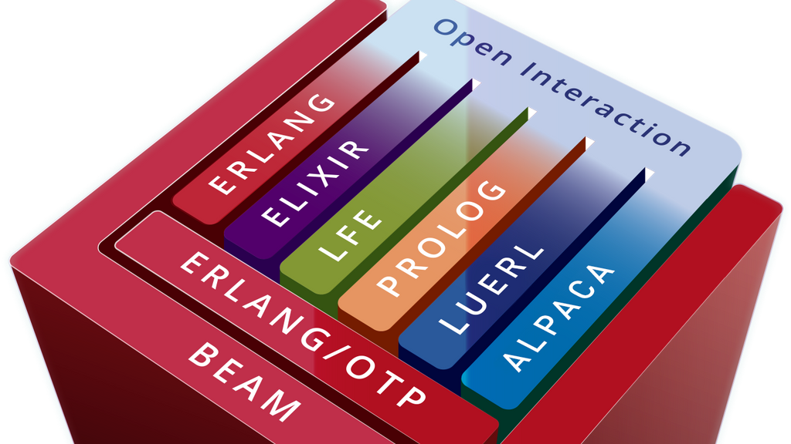

# Elixir 

## El auge de los de los lenguajes de programación funcional

En la últimas dos décadas hemos podido observar un repunte en el uso de los lenguajes de programación funcional, quizá la predicción de dicho auge la podamos ver claramente en el famoso artículo escrito por Herb Sutter, un prominente experto en C++, en el año 2005, [The Free Lunch Is Over, A Fundamental Turn Toward Concurrency in Software](http://www.gotw.ca/publications/concurrency-ddj.htm). En dicho artículo, Herb Sutter, indicaba algo que ya sabemos hoy, la velocidad de reloj del procesador estaba llegando a sus límites físicos. Las mayores consecuencias de esto eran dos:

<figure>
  
  <figcaption>Intel CPU Trends. <a href="http://www.gotw.ca/images/CPU.png">Fuente de imagen</a>.</figcaption>
</figure>

* La manufactura de procesadores se iba a enfocar en mejor soporte para _multi-threading_ y _multi-cores_.
* _A los desarrolladores de software se nos había acabado el almuerzo gratis_, esto quiere decir que anteriormente la mayoría de las aplicaciones, incluso sin modificación alguna, se hacían el doble de rápidas al cabo de un par de años, solo debías actualizar tu _hardware_, las ganancias venían principalmente de tu CPU y luego de la memoria y discos duros. Pero en aquel entonces, año 2005, la situación obligaba a un cambio de paradigma, teníamos que ajustar o re-diseñar nuestros programas para soportar un mundo concurrente y aprovechar los recursos.

Sin embargo, **la programación concurrente es compleja si tienes que hacerla desde cero**. Por eso en dicho artículo también se menciona que _aquellos lenguajes de programación que ya implementan soporte a la programación concurrente, obtendrán una nueva vida. La expectativa será un incremento en la demanda por lenguajes y sistemas que optimicen estas nuevas áreas._

Como veremos más adelante en este artículo, la programación funcional, la inmutabilidad, el pase de mensajes entre procesos, y otros conceptos más, facilitan ese cambio de paradigma que Herb Sutter mencionaba en su famoso artículo.

[Elixir][], en particular, será el lenguaje funcional del cual hablaremos en detalle en este artículo.

## Acerca de Elixir

* [Elixir][] es un lenguaje dinámico y funcional, diseñado para construir aplicaciones escalables y mantenibles.
* [Elixir][] funciona encima de la máquina virtual de [Erlang][], la cual es conocida por ejecutar sistemas de baja latencia, distribuidos y tolerantes a fallos.
* [Elixir][] es un lenguaje de propósito general, se ha utilizado con éxito en el desarrollo web, software embebido, ingestión de datos y procesamiento multimedia, así como una amplia gama de industrias.

El sitio oficial de [Elixir][], expone algunos [casos de éxito](https://elixir-lang.org/cases.html) por si quieres saber más acerca de cómo compañías a lo largo de diferentes industrias están usando el poder de Elixir y su ecosistema para crear y hacer crecer sus negocios.

Llegados a este punto, ya vas observando que al hablar de [Elixir][], también tenemos que hablar de [Erlang][], así que mejor hagamos una pausa para hablar sobre [Erlang][] y su ecosistema.

## Erlang y su ecosistema

<figure>
  
  <figcaption>Erlang Ecosystem y la interacción entre sus distintas implementaciones. <a href="https://www.meetup.com/en-AU/L-O-B-Stockholm/">Fuente de imagen</a></figcaption>
</figure>

En la actualidad existe todo un ecosistema que aprovecha la máquina virtual de Erlang o BEAM (_Bogdan/Björn's Erlang Abstract Machine_). Tenemos a Erlang y Elixir por un lado. Hasta lenguajes como [LFE](https://lfe.io) que permite la sintaxis de Lisp, o [Erlog](https://github.com/rvirding/erlog) que permite ejecutar Prolog, [Lua](https://github.com/rvirding/luerl), [Gleam](https://gleam.run), entre otros.

Erlang es un lenguaje originalmente desarrollado dentro de _Ericsson Computer Science Laboratory_ alrededor del año 1986, que posteriormente fue liberado open-source en 1998. Ericsson impuso algunos requisitos que vienen a cubrir gran parte de las necesidades en sistemas distribuidos hoy día. Los requisitos fueron:

- Manejar un gran número de actividades concurrentes.
- Acciones a realizar en un momento determinado o dentro de cierto tiempo. A esto también se le conoce como sistemas _soft-real time_.
- Sistemas distribuidos en varios ordenadores.
- Interacción con hardware.
- Sistemas de software muy grandes.
- Funcionalidad compleja, como la interacción entre componentes.
- Funcionamiento continuo durante varios años.
- Mantenimiento de software (reconfiguración, etc.) sin detener el sistema. También conocido en algunos entornos como _hot swapping code_.
- Requisitos estrictos de calidad y confiabilidad.
- Tolerancia a fallas. Esto incluye tanto fallas de hardware como errores de software.

Erlang llegó a cubrir todos los requisitos impuestos por Ericsson, lo cual ofrece la posibilidad de desarrollar sistemas distribuidos bastante robustos. Y ha sido probado en multiples sistemas en producción por décadas.

En la máquina Virtual de Erlang todo el código se ejecuta en pequeños procesos concurrentes.

* Cada uno de esos procesos contiene su propio estado, dicho estado no es compartido en lo absoluto con otros procesos.
* Dichos procesos hablan unos con otros procesos por medio de pase de mensajes.
* El intercambio de mensajes entre procesos es gestionado por la máquina virtual de Erlang, de manera transparente.
* Erlang, ofrece un ambiente perfecto para el desarrollo de software distribuido.

Si no has programado en Erlang, seguramente has sido usuario indirecto o directo. Te comparto algunas estadísticas ofrecidas en la charla [How Cisco is using Erlang for intent-based networking](https://codesync.global/media/https-youtu-be-077-xjv6plq/):

* Cisco despliega 2 millones de dispositivos por año con Erlang en ellos.
* 90% de todo el tráfico de Internet atraviesa nodos controlados por Erlang.
* Los 8 mayores proveedores de servicios y proveedores de equipos de redes usan Erlang para controlar sus sistemas.

Sin embargo, en la opinión del creador de Elixir, [José Valim][josevalim], a pesar de las ventajas claras que ofrece Erlang, [hace más de una década](https://dashbit.co/blog/ten-years-ish-of-elixir), sintió que habían partes que echaba de menos de otros lenguajes. Algunas de esas partes él solía usarlas en su día a día, como la meta-programación, extensibilidad del software brindando polimorfismo por medio de [Protocols][], y algunas herramientas que incrementan la productividad de los desarrolladores; algunas otras las descubrió al leer el libro [Seven Languages in Seven Weeks](https://pragprog.com/titles/btlang/seven-languages-in-seven-weeks/). Así que decidió explorar la posibilidad de desarrollar un nuevo lenguaje encima de la máquina virtual de Erlang. Dicho lenguaje fue Elixir. En esencia, puedes ver a Elixir como otro lenguaje de programación funcional que expone todo lo que la máquina virtual de Erlang viene proveyendo por décadas de una manera diferente y a otros desarrolladores que no lo habrían experimentado de otra manera.

## ¿Cómo se ve Elixir?

```elixir
defmodule Grapheme do
  @moduledoc """
  Basic operations over Unicode graphemes

  A grapheme is a minimally distinctive unit of writing
  in the context of a particular writing system.
  """

  @doc "Returns a map with the grapheme frequencies"
  def frequencies(string) do
    string
    |> String.graphemes()
    |> Enum.frequencies()
  end
end
```

```elixir
iex> Grapheme.frequencies("Elixir")
%{"E" => 1, "i" => 2, "l" => 1, "r" => 1, "x" => 1}
```

## Funcionalidades de la plataforma

### Escalabilidad

Todo el código en Elixir se ejecuta dentro de hilos de ejecución livianos, llamados procesos, que están aislados unos de otros e intercambian información vía mensajes.

```elixir
current_process = self()

# Spawn an Elixir process (not an operating system one!)
spawn_link(fn ->
  send(current_process, {:msg, "hello world"})
end)

# Block until the message is received
receive do
  {:msg, contents} -> IO.puts(contents)
end
```

Dada la naturaleza liviana de estos procesos, no es extraño tener cientos de miles de procesos ejecutándose simultáneamente en la misma máquina. El aislamiento entre procesos permite que la recolección de elementos no utilizados o basura (_garbage collected_) sea independiente, lo que reduce las pausas en todo el sistema y utiliza los recursos de la máquina de la manera más eficiente posible (escalabilidad vertical)

Los procesos también pueden comunicarse con otros procesos que se ejecutan en diferentes máquinas en la misma red. Esto proporciona la base para la distribución, lo que permite a los desarrolladores coordinar el trabajo en varios nodos (escalabilidad horizontal).

### Tolerancia a fallos

La verdad inevitable sobre el software que se ejecuta en producción es que _las cosas saldrán mal_. Más aún cuando tenemos en cuenta la red, los sistemas de archivos y otros recursos de terceros.

Para hacer frente a las fallas, Elixir proporciona supervisores que describen cómo reiniciar partes de su sistema cuando las cosas salen mal, volviendo a un estado inicial conocido que se garantiza que funcionará.

```elixir
children = [
  TCP.Pool,
  {TCP.Acceptor, port: 4040}
]

Supervisor.start_link(children, strategy: :one_for_one)
```

La combinación de tolerancia a fallas y programación basada en eventos a través del pase de mensajes hace que Elixir sea una excelente opción para la programación reactiva y arquitecturas robustas.

## Funcionalidades del lenguaje

### Programación funcional

La programación funcional promueve un estilo de código que ayuda a los desarrolladores escribir código que es breve, conciso, y mantenible. Por ejemplo, la coincidencia de patrones permite a los desarrolladores descomponer fácilmente las estructuras de datos y acceder a su contenido.

```elixir
%User{name: name, age: age} = User.get("John Doe")
name #=> "John Doe"
```

Cuando mezclamos guardas, la coincidencia de patrones nos permite especificar de manera elegante las condiciones específicas en las que un bloque de código se ejecutará. 

```elixir
def drive(%User{age: age}) when age >= 16 do
  # Code that drives a car
end

drive(User.get("John Doe"))
#=> Fails if the user is under 16
```

Elixir depende en gran medida en estas funcionalidades para garantizar que el software funcione en las condiciones esperadas. Y cuando eso no pasa, no te preocupes, los supervisores, mencionados en la sección previa, cuidaran nuestras espaldas.

### Extensibilidad y DSLs (_Domain-Specific Languages_)

Elixir ha sido diseñado para ser extensible, dejando que los desarrolladores naturalmente extiendan el lenguaje a dominios particulares con el propósito de incrementar su productividad.

Un ejemplo claro de esto es el framework de pruebas unitarias incluido en Elixir, llamado [ExUnit][].

```elixir
defmodule MathTest do
  use ExUnit.Case, async: true

  test "can add two numbers" do
    assert 1 + 1 == 2
  end
end
```

La opción `async: true` permite que los tests corran concurrentemente, usando tantos CPU cores como sea posible. Mientras que `assert` puede hacer introspección del código, proveyendo reportes en caso de fallas. Estas funcionalidades fueron construidas usando macros, haciendo posible agregar nuevos constructos tal como si fueran parte del lenguaje.

## Herramientas

### Mix

Elixir viene con un gran conjunto de herramientas para facilitar el desarrollo. [Mix][] es una herramienta que te permite crear proyectos, administrar tareas, ejecutar pruebas y más.

```console
$ mix new my_app
$ cd my_app
$ mix test
.

Finished in 0.04 seconds (0.04s on load, 0.00s on tests)
1 test, 0 failures
```

Mix también puede administrar dependencias y se integra con el [administrador de paquetes Hex][Hex], el cual te permite realizar resolución de dependencias, obtener paquetes remotos y alojar documentación para todo el ecosistema de Erlang.

### Desarrollo interactivo

Herramientas como [IEx (la consola interactiva de Elixir)][IEx] te ofrecen una manera de explorar todas las ventajas del lenguaje. Permite auto-completado, ayudantes para depuración del código, acceso a la documentación con un formato amigable, entre otros.

```console
$ iex
Interactive Elixir - press Ctrl+C to exit (type h() ENTER for help)
iex> h String.trim           # Prints the documentation for function
iex> i "Hello, World"        # Prints information about the given data type
iex> break! String.trim/1    # Sets a breakpoint in the String.trim/1 function
iex> recompile               # Recompiles the current project on the fly
```

### Compatibilidad con Erlang

Como ya hemos mencionado previamente, [Elixir][] se ejecuta sobre la máquina virtual de [Erlang][], lo cual permite a los desarrolladores acceder al ecosistema de Erlang. Desde Elixir puedes invocar funciones de Erlang sin ningún costo en tiempo de ejecución.

```elixir
iex> :crypto.hash(:md5, "Using crypto from Erlang OTP")
<<192, 223, 75, 115, ...>>
```

## Resumen

Tal como indica el libro [The Pragmatic Programmer](https://pragprog.com/titles/tpp20/the-pragmatic-programmer-20th-anniversary-edition/), se recomienda que uno invierta regularmente en su portafolio de conocimientos, haciendo del aprendizaje un hábito.

El punto es que los lenguajes de programación de cierta manera afectan la forma en la que uno piensa acerca de la programación, y aprender nuevos lenguajes puede ayudarte mucho a pensar en resolver problemas de manera distinta, especialmente si el lenguaje que vas aprender es bastante diferente del cual estás manejando hoy día o del cual te sientes más cómodo. En este caso, si no has explorado el paradigma funcional, Elixir es una excelente oportunidad para hacerlo.

Por otro lado, si lo que buscas es la posibilidad de mejorar tu salario como desarrollador, Elixir te puede ofrecer un camino para lograrlo, fijate que según [Stack Overflow Developer Survey 2021](https://insights.stackoverflow.com/survey/2021), [Elixir se encuentra los lenguajes de programación con mejor salario](https://insights.stackoverflow.com/survey/2021#section-salary-salary-and-experience-by-language), en la misma encuesta también puedes encontrar que el [porcentaje de personas que adoran trabajar con Elixir es bastante alto](https://insights.stackoverflow.com/survey/2021#section-salary-salary-and-experience-by-language).

Por todo lo expuesto en este artículo, te invito para que aprendas más sobre Elixir,
revisa nuestro curso introductorio sobre este hermoso lenguaje, también puedes revisar la [guía de inicio oficial][getting-started].

## Referencias

* [The Elixir programming language][Elixir]
* [A history of Erlang](https://dl.acm.org/doi/abs/10.1145/1238844.1238850)
* [The Free Lunch Is Over. A Fundamental Turn Toward Concurrency in Software](http://www.gotw.ca/publications/concurrency-ddj.htm)

[Elixir]: https://elixir-lang.org
[Erlang]: https://www.erlang.org
[ExUnit]: https://hexdocs.pm/ex_unit/
[Mix]: https://hexdocs.pm/mix/
[Hex]: https://hex.pm/
[IEx]: https://hexdocs.pm/iex/
[getting-started]: https://elixir-lang.org/getting-started/introduction.html
[josevalim]: https://github.com/josevalim
[Protocols]: https://elixir-lang.org/getting-started/protocols.html